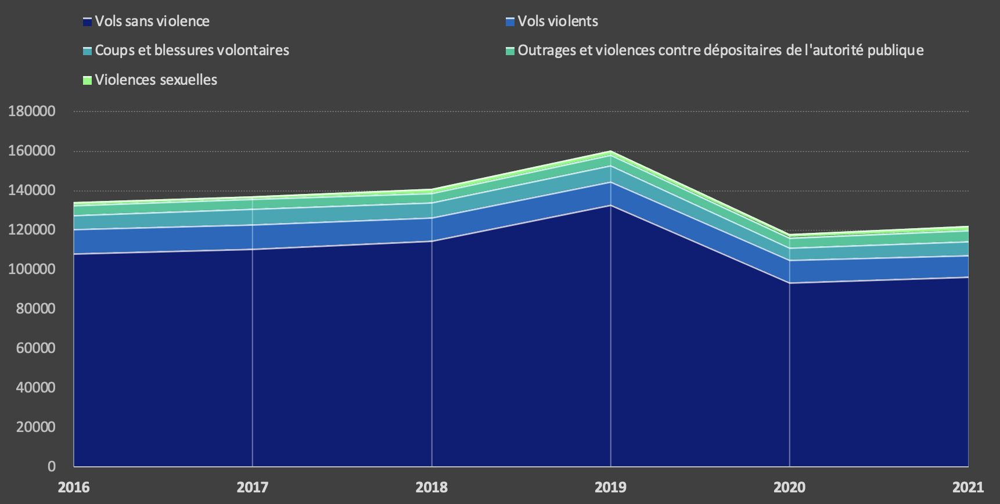
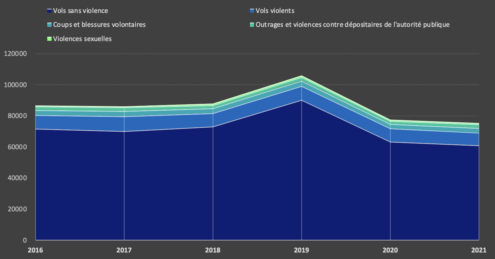
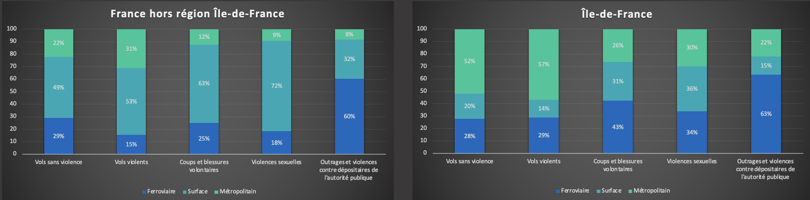
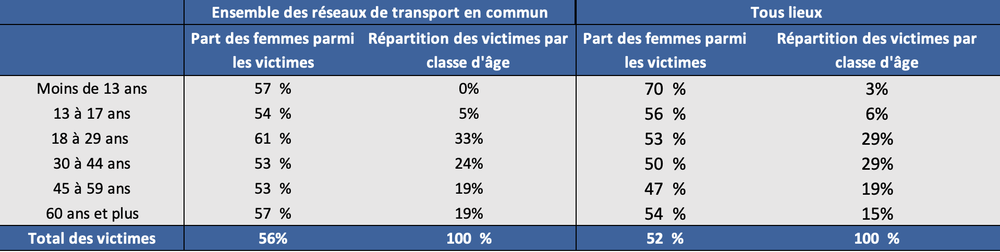
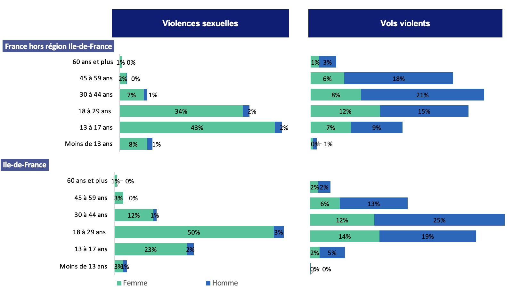

# Violences dans les transports en commun en Île-de-France

## Summary
* [Introduction](#introduction)
* [Analyse des données](#analyses-des-données)
* [Usages des données](#usages-des-données)
* [Limites](#limites)

## Introduction

En France, le thème de l’insécurité demeure au cœur du débat public et fait régulièrement l’actualité des journaux où sur les plateaux télévisés. En 2021, elle est classée comme la deuxième préoccupation des Français d’après [la dernière étude](https://www.europe1.fr/societe/la-delinquance-est-la-deuxieme-preoccupation-des-francais-en-2021-4100114) du ministère de l’Intérieur. Cette étude statistique présente une série d’indicateurs illustrant l’évolution des faits de délinquance. On observe ainsi une tendance haussière de ce type de délits avec par exemple une [augmentation de 33%](https://www.interieur.gouv.fr/actualites/communiques/insecurite-et-delinquance-bilan-statistique-2021) les plaintes pour violences sexuelles. Parallèlement, les violences commises dans les transports en commun [ont également rebondi](https://mobile.interieur.gouv.fr/Interstats/Actualites/Les-vols-et-violences-enregistres-dans-les-reseaux-de-transports-en-commun-en-2021-Interstats-Analyse-N-48) après avoir connu un déclin pendant la crise sanitaire.

Dans ce climat d’insécurité auquel s’ajoute la menace de nouveaux attentats terroristes qui plane toujours dans le pays, le thème de l’insécurité s’est imposé parmi les principaux enjeux des [élections régionales de 2021](https://www.france24.com/fr/france/20210522-la-sécurité-thème-omniprésent-de-la-campagne-des-régionales), bien qu’il ne relève pas de leurs compétences. Il demeure également un enjeu central dans le renforcement des effectifs de la police municipale. Il n’est donc pas étonnant que pendant la dernière [campagne présidentielle](https://www.lavoixdunord.fr/1158633/article/2022-03-27/presidentielle-2022-delinquance-la-surenchere-securitaire-des-candidats), cette thématique ait pris une ampleur inédite. Certains candidats ayant même jusqu’à faire des propositions remettant en cause l’État de droit. En outre, la France fait également face à de nouveaux types de menaces sous la forme de cyberattaques. Comme les attentats, ce type d’attaques peut causer des dégâts considérables dès lors qu’il s’agit d’attaques sur des secteurs stratégiques tels que les hôpitaux ou le secteur de l’énergie. Depuis la crise sanitaire, nous avons pu observer une forte augmentation des cyberattaques dans les entreprises, les services publics et les collectivités territoriales. Ce type de menaces a en effet [quintuplé](https://www.ndnm.fr/statistiques-cybersecurite-2022/) depuis 2020. 

La capitale, comme de nombreuses grandes métropoles française, demeure dans le bas du [classement des villes les plus sûres en France](https://www.leparisien.fr/faits-divers/delinquance-quelles-villes-sont-les-plus-sures-de-france-notre-classement-exclusif-12-11-2022-INTRKKSGFFCXDPTI6EPTTW275M.php). Pour remédier à ce problème, l’enjeu de la sécurité dans les transports en commun est aujourd’hui central. La moitié des usagers de transport métropolitain disent avoir ressenti en 2020 [une forme d’insécurité](https://france3-regions.francetvinfo.fr/paris-ile-de-france/metro-et-rer-securite-et-sentiment-d-insecurite-dans-les-transports-les-chiffres-cles-en-ile-de-france-2629484.html) dans les transports en commun et ont considéré que la présence d’agents de sécurité dans le réseau était insuffisante. Ce constat est également partagé par les touristes de la capitale, régulièrement pris pour cible dans les transports en commun. De plus, la sécurité dans les transports tend à devenir un sujet de plus en plus important avec  l'accueil des Jeux Olympiques de Paris 2024. Avec la montée des violences, la présidente de la région Île-de-France, Valérie Pécresse, a annoncé [le recrutement d’un millier d’agents de sécurité supplémentaires](https://www.20minutes.fr/paris/4004326-20221009-ile-france-mobilites-va-recruter-1-000-agents-securite-supplementaires-annonce-valerie-pecresse). Elle a également évoqué son souhait de créer une police régionale des transports pour faire face à la montée des violences. 

Usagers quotidiens des transports, nous avons donc porté notre attention sur les violences commises dans les transports en commun. Nous avons choisi de nous pencher sur l’étude statistique publiée par le ministère de l’Intérieur intitulée « Les vols et violences enregistrés dans les réseaux de transports en commun en 2021 ». Cette base de données a été conçue par Interstats, le service statistique rattaché au ministère de l’Intérieur à partir des dépôts de plaintes et de mains courantes recensées par les services de police et la gendarmerie nationale. Elle présente le nombre des délits commis en 2021 dans les transports en commun en France, avec une attention particulière apportée à la région Île-de-France. Cette étude présente également à titre de comparaison les données des années antérieures jusqu’en 2016. Cette base de données présente les différents types de violences et leur répartition selon les types de transport en commun ainsi que les caractéristiques et profils des victimes et des mis en cause. Le travail réalisé par Interstat à travers ce type de base de données est aujourd'hui essentiel dans l'élaboration et l'évaluation des politiques publiques mises en place à l’échelle nationale, régionale et municipale. Il est cependant fondamental dans questionner ses limites et ses biais. Après avoir analysé les données présentées dans cette étude statistique, nous nous interrogerons sur les choix de catégories établis par Interstat. Nous verrons notamment que l’analyse à l’échelle régionale n’étant possible que pour l’Île-de-France ce qui rend complexe la comparaison avec les autres régions. Par ailleurs, nous verrons que les données relatives au type de violences sont également limitées aux catégories définies par la police et la gendarmerie et ne concernent que les plaintes et mains courantes déposées en commissariat. 

Afin de questionner les fondements de cette base de données, nous avons pris contact avec Interstat afin de les questionner sur le processus de collecte des données et leurs usages.
 
Bien que cette base de données comporte des imperfections, elle demeure un outil essentiel pour évaluer le niveau d’insécurité dans les transports en commun. Ce rapport est aujourd'hui une référence pour les autorités publiques et demeure une source d'information fondamentale pour les citoyens.

## Analyses des données

La publication annuelle du rapport sur les vols et violences enregistrés dans les réseaux de transports en commun par le service statistique en charge de la sécurité intérieure (SSMI), permet en premier lieu, de comprendre sur une période donnée, l’évolution de ce type de violences par rapport aux violences enregistrées dans tout lieu confondu. Ce rapport se fonde sur les données issues des dépôts de plaintes recensés par la police et la gendarmerie nationale. Il nous permet de dégager différentes tendances quant à l’évolution des vols et violences enregistrés dans les réseaux de transports en commun entre 2016 et 2021.

**Évolution du nombre de vols et de violences dans l'ensemble des transports en commun (France) de 2016 à 2021**

**Évolution du nombre de vols et de violences dans l'ensemble des transports en commun (Île-de-France) de 2016 à 2021**

Ce rapport distingue tout d’abord différentes catégories de faits de délinquance comme les vols avec et sans violences, les violences sexuelles, mais aussi les coups et blessures volontaires ou encore les outrages et violences contre un dépositaire de l'autorité publique. Nous pouvons ainsi remarquer que les vols sans violence constituent l'atteinte la plus caractéristique des faits de délinquance enregistrés en France et plus particulièrement dans les transports en commun. Ils représentent 79 % des victimes de vols et de violences dans les transports en commun.

Contrairement à une idée reçue, bien que le nombre de vols sans violences augmentent légèrement en 2021 (+3 % par rapport à 2020), leur taux reste inférieur à celui recensé avant la crise sanitaire. On observe en parallèle de ce phénomène, une nette diminution des vols violents depuis 2018, que cela soit dans les transports en commun ou dans tout lieu confondu. Ces deux tendances contrastent avec le nombre de victimes de violences sexuelles qui connaît une très forte augmentation depuis 2016, que ce soit dans les transports en commun (+32 %) ou dans le reste de la France (+33 %).

Ce rapport illustre également les spécificités des vols et violences enregistrés dans les transports en commun d’Île-de-France et hors Île-de-France. On observe par exemple que hors Île-de-France, 53 % des victimes de vols violents ont été enregistrées dans le réseau de surface tandis que cette proportion n’est que de 14 % en Île-de-France. Dans cette région, 57 % des vols violents sont enregistrés dans le réseau métropolitain.

**Répartition du nombre de victimes de vols et de violences dans les transports en commun en 2021 par type de réseau**

Il est également important de souligner que les spécificités de la délinquance dans les transports en commun s’illustrent notamment dans le profil des victimes. L'âge et le sexe des victimes dans les transports en commun sont similaires à ceux des victimes des mêmes atteintes tout lieu confondu. Cette tendance s’observe en Île-de-France ainsi que dans les autres régions. On remarque par exemple que les femmes représentent 61 % des victimes de vols ou violences dans les transports en commun ce qui est un taux supérieur à celui observé dans tout lieu confondu (53 %). Par ailleurs, ce sont les 18-29 ans qui sont le plus souvent visées par ce type de violences. On remarque cependant des disparités quant au type de violences subies par les femmes. Si nous observons en détail le cas des violences sexuelles on peut remarquer que les femmes sont nettement plus exposées aux violences sexuelles qu’à des coups et blessures volontaire par exemple. 

**Répartition des victimes de vols et de violences dans les transports en commun en 2021 par âge, par sexe et par type de délinquance**

Enfin cette étude statistique présentée par le SSMI, met également en lumière la nationalité des victimes qui sont le plus souvent étrangères. Elles représentent Île-de-France, 26 % des victimes en 2021 contre 22 % tout lieu confondu. Cependant, ce taux reste inférieur à celui observé avant la crise sanitaire, ce qui semble s’accorder avec la baisse de la fréquentation touristique observée depuis 2020. 
Cette étude met également en avant certaines récurrences dans le profil des mis en cause : 88 % sont des hommes dont 72 % d’entre eux ont entre 13 et 29 ans ce qui est une moyenne d’âge nettement inférieur à celui observé dans tout lieu confondu où 65 % d’entre eux ont entre 18 et 44 ans. 

## Usages des données

Ces statistiques sont des sources importantes pour motiver et justifier les politiques de sécurité. Ainsi, ces données permettent d’orienter les décideurs politiques. Les enjeux de sécurité ont une importance croissante dans les débats publics. Le harcèlement de rue, les agressions dans les transports ou encore les menaces terroristes sont autant d’évènements qui nécessitent le déploiement de mesures de sécurités au quotidien pour protéger les citoyens.

Ainsi pour les transports en commun, [Île-de-France Mobilités va renforcer de 20 % les effectifs de sa brigade régionale de sécurité des transports](https://www.83-629.fr/2022/10/le-de-france-creation-d-une-brigade-regionale-de-securite-1000-agents-de-securite-a-recrutes.html) afin de passer de 4 000 agents en  2022 à 5 000 en 2027[^1].

De plus, il existe désormais un numéro d’appel unique ainsi que des bornes d’urgence pour signaler tout incident. Ce numéro permet aussi de signaler toutes agressions verbales. Notons que les statistiques mettent en évidence le nombre d’étrangers, notamment des touristes, victimes dans les transports parisiens. Il est donc important d’avoir un interlocuteur bilingue. 
 

Face à l’insécurité et le nombre de voyageurs croissants, Ile-de-France Mobilités qui est un établissement public régional, travaille en partenariat avec la Préfecture de Police de Paris pour la vidéo-protection ainsi qu’avec la Gendarmerie nationale. Nous pouvons aussi souligner les 2 000 patrouilles de gendarmerie dans les transports et les gares. Ces forces de l’ordre armées, aguerries et assermentées sont essentielles dans la lutte contre le terrorisme.

Ainsi c’est donc tout un ensemble d’outils et d’acteurs qui sont déployés. Il sera donc intéressant d’observer ces mêmes statistiques dans une puis deux années afin de voir si ces efforts ont porté leurs fruits.

 

## Limites

